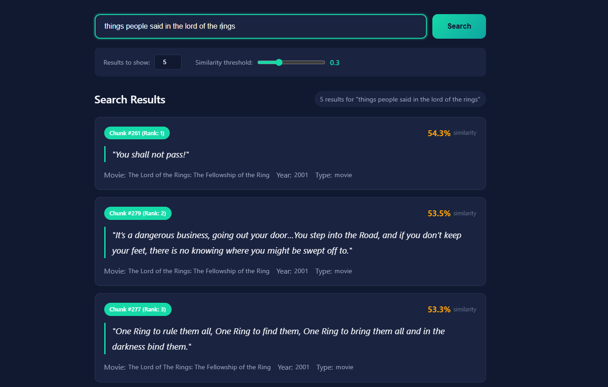

# RAG Movie Quotes Retrieval System

A semantic search system for movie quotes using Retrieval-Augmented Generation (RAG). Search through famous movie quotes by meaning, not just keywords.

---

<div style="display: flex; gap: 16px; align-items: flex-start;">
  
  
</div>

---

## Overview

This system demonstrates the **retrieval component** of RAG without LLM generation. It allows semantic search through movie quotes - queries like "quotes about never giving up" will find relevant inspirational quotes even without exact keyword matches.

**What it does:**

- Generates embeddings using OpenAI's text-embedding-3-small
- Stores vectors in ChromaDB
- Retrieves relevant quotes based on semantic similarity
- Displays results with similarity scores in a web interface

_(Note: No LLM-generated responses, chatbot functionality, or answer generation)_

---

## Dataset Source

**Source:** Movie quotes loaded from `backend/data/movie_quotes.csv`

**Kaggle Dataset:** [Movie Quotes on Kaggle](https://www.kaggle.com/datasets/mexwell/movie-quotes)

> **NOTE:** The full Kaggle dataset contains 733 quotes (~76,000 characters), but this implementation uses only the first 303 rows to stay under a 30,000 character limit. The system automatically stops reading after line 303.

**Why this dataset:**

- Semantically rich - each quote carries meaning, emotion, and context
- Appropriately sized - 303 quotes, ~30,000 characters
- Diverse queries - supports thematic, movie-specific, and character-based searches
- Familiar content - makes results intuitive to evaluate

**Example queries:**

- "quotes about hope" → inspirational quotes
- "Star Wars quotes" → movie-specific search
- "what did Forrest Gump say" → character-based
- "quotes about courage" → conceptual search

---

## Setup Instructions

### Prerequisites

- Python 3.9+
- OpenAI API key ([Get one here](https://platform.openai.com/api-keys))
- Git

### 1. Clone the Repository

```bash
git clone https://github.com/DavidWeschler/RAG-Movie-Quotes-Retrieval-System.git
cd RAG-Movie-Quotes-Retrieval-System
```

### 2. Navigate to Backend

```bash
cd backend
```

### 3. Set Up Python Environment

```bash
# Create virtual environment
python -m venv .venv

# Activate virtual environment
# Windows:
.venv\Scripts\activate
# macOS/Linux:
source .venv/bin/activate

# Install dependencies
pip install -r requirements.txt
```

### 4. Configure OpenAI API Key

Create a `.env` file in the `backend/` directory:

```
OPENAI_API_KEY=sk-your-actual-api-key-here
```

### 5. Start the Backend Server

```bash
uvicorn app.main:app --reload --host 0.0.0.0 --port 8000
```

You should see:

```
INFO:     Uvicorn running on http://0.0.0.0:8000
```

### 6. Initialize the Vector Database

Open in browser:

```
http://localhost:8000/initialize
```

This generates embeddings and stores them in ChromaDB.

### 7. Open the Frontend

Open `frontend/index.html` in your browser, or serve it:

```bash
# From project root
python -m http.server 3000
```

Then navigate to `http://localhost:3000/frontend/`

---

## Components

1. **Frontend** - HTML/CSS/JavaScript interface for search
2. **Backend** - FastAPI server handling RAG logic
3. **Vector Store** - ChromaDB for persistent embedding storage
4. **Embeddings** - OpenAI text-embedding-3-small model

---

## Design Decisions

### Vector Database: ChromaDB

**Why ChromaDB:**

- **Free and easy to use** - No cost, simple to install on your computer
- **No extra setup needed** - Works right away, doesn't need a database like PostgreSQL
- **Saves your data automatically** - Your searches are stored without extra code
- **Simple to code with** - Easy-to-understand commands in Python
- **Better than alternatives** - Pinecone costs money after free tier, Weaviate is complicated, FAISS doesn't save data easily

**Trade-offs:** Pinecone is cloud-based but requires account; Weaviate has more features but is overkill for 303 documents; FAISS is faster but lacks persistence.

### Embedding Model: text-embedding-3-small

**Why this model:**

- Cost-effective: $0.00002/1K tokens
- Quality: Strong benchmark performance
- Dimensions: 1536 (good balance)
- Speed: Fast inference

**Cost estimation:**

- 303 quotes × ~100 tokens = ~30,000 tokens
- Cost: 30,000 / 1,000 × $0.00002 = **$0.0006**
- Per search: ~$0.000004

### Chunking Strategy

**Parameters:**

- Chunk Size: 500 characters
- Chunk Overlap: 50 characters (10%)

**Reasoning:**

- Movie quotes are naturally short (< 500 chars each)
- Each quote treated as a single, complete chunk
- No splitting needed, preserving semantic integrity
- Chunking utilities included for extensibility

### Retrieval Parameters

**Top-K: 5 (default)**

- Returns 5 most similar quotes
- Balances comprehensiveness with relevance
- User-adjustable (1-20)

**Similarity Threshold: 0.3 (default)**

- Filters out low-relevance matches
- 0.3 is permissive (catches distant semantic matches)
- User-adjustable (0.0-1.0)

**Rationale:** Semantic search finds non-obvious matches; lower threshold helps discover related content; Top-K limits prevent overwhelming results.

---

## API Documentation

### Key Endpoints

**Health Check**

```
GET /
GET /health
```

**Initialize Database**

```
POST /initialize?force_rebuild=false
```

**Search (GET)**

```
GET /search?query=love&top_k=5&similarity_threshold=0.3
```

**Search (POST)**

```
POST /search
Content-Type: application/json

{
  "query": "quotes about love",
  "top_k": 5,
  "similarity_threshold": 0.3
}
```

**Stats & Config**

```
GET /stats
GET /config
```

### Response Format

```json
{
  "query": "quotes about love",
  "results": [
    {
      "id": "4",
      "document": "Quote: \"Here's looking at you, kid.\"...",
      "metadata": {
        "movie": "Casablanca",
        "year": 1942,
        "type": "movie",
        "original_quote": "Here's looking at you, kid."
      },
      "similarity_score": 0.6234,
      "distance": 0.3766
    }
  ],
  "total_results": 5
}
```

---
